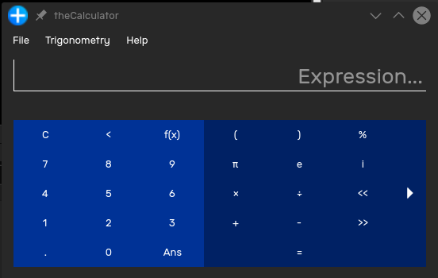

Let's get started with theCalculator.

# Expression Box
 
To start calculating, enter an expression into the Expression box. The answer will be calculated and will appear below the expression box as you type. Any errors will also appear under the expression box.

For example,
- $$3 + 5$$: 3+5
- $$5^2$$: 5CTRL+2
- $${5 \pi} \over {2}$$: (5CTRL+P)/2
- $$3 \times 10 ^ 4$$: 3SPACE10CTRL+4
- $$e^{i \pi}$$: e^(iSPACECTRL+P)
- $${sin(52 + \log_5(25))} \over {3}$$: sin(52+log(25,5))/3

# Assigning Variables
Variables will stick around in memory until theCalculator is closed. To store a variable, use the = operator. As you enter in the expression to save in the variable, a preview will appear below the expression box. Once you're happy to store the expression into the variable, press ENTER. You can then reference the variable by using its identifier in future.

For example,
- to set $$x$$ to $$5$$, x=5ENTER
- to set $$interest$$ to $$0.03$$, interest=0.03ENTER

Expressions can also be used on the right hand side.
- to set $$sqrt2$$ to $$\sqrt{2}$$, sqrt2=CTRL+R2ENTER
