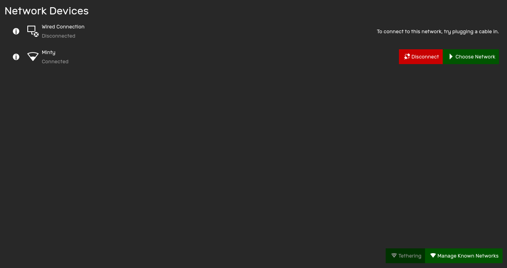

Connecting to the internet using theShell is easy.

# Opening the Network Connection Manager
To open the Network Connection Manager, either
- Open the [Status Center] and switch to the Networks panel, or
- Open [System Settings], and select the Networks pane

# Connecting to a Wi-Fi Network
To connect to a Wi-Fi network,
1. Click "Choose Network" on the wireless network card you'd like to connect with
2. Select an available network to connect to
3. If required, enter any authentication details needed to connect to the internet, and then click "Connect"

**WPA Enterprise connections should work, but if they don't, please file a bug report.**

# Connecting to a hidden Wi-Fi Network
If the SSID of your Wi-Fi network is hidden, connect to the network by
1. Click "Choose Network" on the wireless network card you'd like to connect with
2. Click "Enter Details Manually"
3. Enter the requested information to connect to the network, and then click "Connect"

# Disconnecting from a network
To disconnect from a connected network,
1. Click "Disconnect" on the network you want to disconnect from

# Viewing Network Information
To view network information such as MAC Address, IP Address and other properties,
1. Click on the information button to the left of the wireless network card you'd like to view information about

# Forgetting known networks
To forget a network so theShell will no longer connect to it automatically,
1. Click "Manage Known Networks"
2. Select the network you would like to forget
3. Click on "Forget"

# Flight Mode
Flight Mode turns off all transmitting radios, including Wi-Fi, Bluetooth, Telephony and Data.

To enable Flight Mode,
1. Open the [Status Center]
2. Enable the Flight Mode Quick Switch.

Wi-Fi and Bluetooth can be turned on independently after Flight Mode is switched on. To do so, simply enable the Quick Switch next to the technology you wish to switch on.


