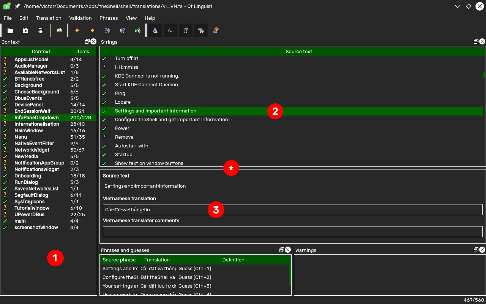
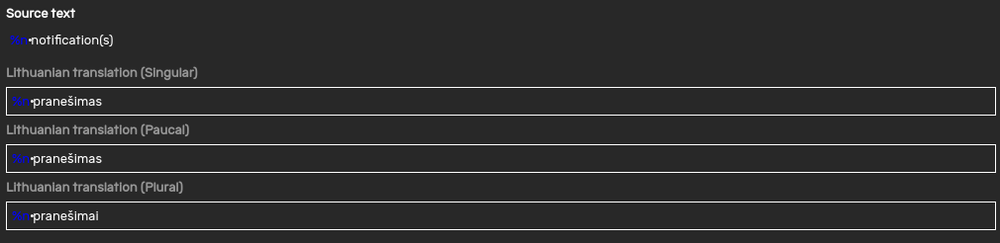

Thanks for choosing to help translate theShell. By translating theShell, you're helping to increase the accessibility of theShell.

## Getting Translation files
To register your interest in translating theShell, [please fill out this form.](https://docs.google.com/forms/d/e/1FAIpQLSfaw9JCpBltgfJUHqR7mOb8fTgTMZBS5hGcHvFUj-L6vASWOg/viewform?usp=sf_link) Alternatively, you can directly contact me using any contact method.

## Installing Qt Linguist
Translations are made using an app called Qt Linguist. Depending on your platform, follow the following steps to obtain it.

### Windows
Qt Linguist is available as a standalone app on Windows here.
[Qt Linguist](https://github.com/lelegard/qtlinguist-installers/releases/download/v5.9.2/QtLinguist-5.9.2.exe)

### macOS
Qt Linguist is available as a standalone app on macOS here.
[Qt Linguist](https://github.com/lelegard/qtlinguist-installers/releases/download/v5.9.2/QtLinguist-5.9.2.dmg)

### Linux
- **Ubuntu:** `qt5-dev-tools`
- **Arch Linux:** `qt5-tools`
- On other distributions it might be a good idea to take a look at your package manager.

## Translating
Open the translation file with Qt Linguist to get started.

1. Translation Groups
2. Translation Items
3. Translated Text

TIP: If the translated text doesn't appear, drag the space denoted by * upwards to reveal it.

### Translation Groups
Each Translation group represents a module in theShell. This can come in handy when you need to report a translation issue.

### Translation Items
Each Translation item is a string to be translated. 

### Translated Text
Translated text for the currently selected translation item is placed in this field.
- %1, %2, ... denotes text to be replaced.
- %n denotes a number.

#### Pluralisation

When coming across a phrase that contains a number replacement, you may be presented with this UI. This allows correct pluralisation in theShell. This dialog may change depending on the language you are translating to. theShell will automatically choose the correct plural form depending on the number.

## Submitting your translation
Once you're finished with your translation, send the translation file back to me and I'll include it in the next theShell release.
